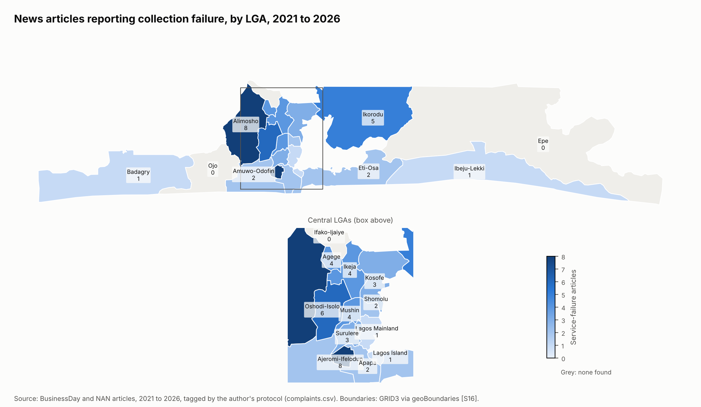
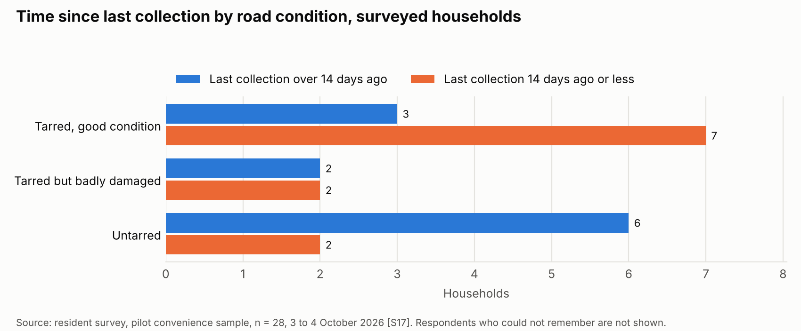
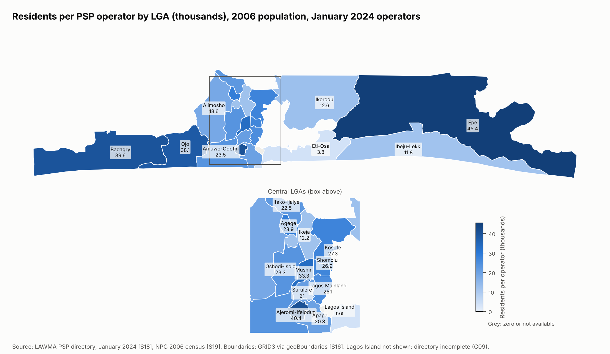

# Paid but Not Served: Why Waste Collection Fails in Lagos

An audit of household waste collection in Lagos State, 2021 to 2026. The study checks the official collection figures, locates reported service failure by Local Government Area (LGA), and tests five explanations for why collection fails.

## Research question

Where in Lagos does household waste collection fail, and which explanation best fits the evidence?

| ID | Explanation | Testable prediction |
|----|-------------|---------------------|
| H1 | Resident non-payment | Areas with lower fee payment rates have lower pickup frequency |
| H2 | Too few operators | Areas with more households per PSP operator have more missed pickups |
| H3 | Poor road access | Streets with unpaved or narrow roads are skipped more often |
| H4 | Dumpsite bottleneck | Areas farther from active dumpsites and transfer stations have longer gaps between pickups |
| H5 | Inequality | Lower-income areas pay similar fees but receive worse service |

## Main findings

1. The official figures do not add up. LAWMA reported 418,500 tonnes reaching disposal sites in May 2026 [S01], which is 90% to 104% of estimated generation [A04] and 2.7 to 3.4 times the collection capacity of 4,000 to 5,000 tonnes per day that LAWMA itself stated for PSP operators in December 2025 [S06]. Reported tonnage equals exactly 10 tonnes per truck trip in separate figures, which indicates that it is estimated from trip counts rather than weighed [S02, A02]. Two months after May, reported disposal volumes were 80% lower (C03).

2. Paying households go unserved. In a pilot survey of 28 households, 21 said they pay their waste bill regularly. Among regular payers served by the PSP or LAWMA truck, 6 of 13 who remembered had last been served more than 14 days earlier, a rate similar to non-payers and occasional payers (3 of 5). No non-payer gave cost as the reason [S17]. Non-payment (H1), the explanation officials give most often in the news record, does not account for these failures.

3. Road condition shows the clearest pattern. Six of 8 surveyed households on untarred roads had waited more than 14 days, against 3 of 10 on good tarred roads [S17]. LAWMA has expanded tricycle collection for communities that compactor trucks cannot reach [S24]. Road access (H3) is the explanation most consistent with the evidence.

4. Disposal sites are a partial bottleneck. Queues and closures at disposal sites appear in 7 of 21 news reports of service failure, and the two main landfills were described in July 2026 as at the end of their operating lives [S24]. Surveyed households with long gaps live in LGAs farther from an active site (median 10.7 km against 7.3 km) [A09]. The evidence for H4 is partial.

5. Operator numbers do not explain where failure is reported. Residents per PSP operator range from 3,835 in Eti-Osa to 45,434 in Epe [S18, S19], but show no significant rank correlation with news reports of failure across 19 LGAs (H2). Operator counts do not record trucks, capacity or performance.

6. The news record mostly reflects official framing. Of 84 relevant articles from BusinessDay and the News Agency of Nigeria, 21 report service failure. Officials are the source of blame in 35 of the 56 articles that assign it, and mostly blame residents. In failure reports, PSP operators are blamed as often as residents.







## Evidence by explanation

| ID | Explanation | Assessment |
|----|-------------|------------|
| H1 | Resident non-payment | Not supported as the main explanation: regular payers also go unserved |
| H2 | Too few operators | Not supported at LGA level |
| H3 | Poor road access | Consistent with the evidence; strongest survey pattern |
| H4 | Dumpsite bottleneck | Partly consistent: disposal delays are reported, and distance aligns with longer gaps |
| H5 | Inequality | Inconclusive: operator coverage varies about twelvefold between LGAs, but the survey shows no clear pattern by home type |

The full comparison is in `notebooks/03_why_it_fails.ipynb`.

## Data and methods

| Phase | Data | Method | Output |
|-------|------|--------|--------|
| 1 Official numbers | 52 figures from LAWMA statements, Lagos State budgets 2021 to 2026 and a World Bank report [S01 to S15] | Consistency checks on tonnage, trips, capacity and budgets | `notebooks/01_official_numbers.ipynb`, `reports/01_do_the_numbers_add_up.md` |
| 2 Where it fails | 213 news articles collected from BusinessDay and the News Agency of Nigeria, 2021 to 2026; resident survey, 28 responses, 3 to 4 October 2026 [S17] | Articles tagged by a language model under a written protocol (`docs/tagging_protocol.md`), with a 50-article sample re-coded against the full text (agreement 90% to 98% per field) and corrections applied; survey cleaned and coded | `data/processed/complaints.csv`, `data/processed/survey_clean.csv`, `notebooks/02_where_it_fails.ipynb` |
| 3 Why it fails | LAWMA PSP directory, January 2024 [S18]; 2006 census population by LGA [S19, S20]; OpenStreetMap landfill locations [S21]; GRID3 LGA boundaries [S16] | Operators and residents per operator by LGA; straight-line distance to the nearest active disposal site; Spearman rank correlations across LGAs; survey cross-tabulations | `data/processed/lga_indicators.csv`, `notebooks/03_why_it_fails.ipynb` |

Every figure in `data/processed/` carries a source ID from `docs/sources.md` (26 sources, each rated High, Medium or Low for reliability). Disagreements between sources are recorded in `docs/data_conflicts.md` (9 conflicts) and assumptions in `docs/assumptions.md` (11 assumptions), and both are referenced by ID wherever they are used.

## Limitations

- The survey is a pilot convenience sample of 28 households from 14 LGAs, distributed by link. It describes respondents, not Lagos, and supports statements about direction only.
- News counts show where outlets reported failure, not where failure is most frequent. Guardian, Punch, Vanguard and Peoples Gazette blocked automated access, so only two outlets are included.
- Population figures date from 2006, and the federal and state counts for that year differ by 8.4 million (C08).
- Distances are straight-line from LGA centres to three sites, two of which are matched to unnamed map features [A09, A11].
- No result establishes cause. With 20 LGAs, rank correlations detect only large effects.

## Repository layout

| Path | Contents |
|------|----------|
| `data/raw/` | Downloads kept unchanged. News text, raw survey responses and the PSP directory are not version-controlled |
| `data/interim/` | News index, tags and the verification sample |
| `data/processed/` | Analysis-ready tables |
| `docs/` | Source log, data conflicts, assumptions and the news tagging protocol |
| `notebooks/` | Analysis notebooks 01 to 03 |
| `src/lagos_waste/` | Python package with all reusable code |
| `tests/` | pytest tests for the package |
| `reports/` | Phase 1 note, figures (PNG) and interactive maps (HTML) |
| `survey/` | Questionnaire and the Google Apps Script that builds the form |

## Reproducing the analysis

Python 3.12. From the repository root on Windows PowerShell:

```
py -3.12 -m venv .venv
.venv\Scripts\Activate.ps1
pip install -r requirements.txt
pip install -e .
pytest -q
```

The processed tables are committed, so the notebooks run without the uncommitted raw files. Rebuilding the processed tables from source uses these commands:

| Command | Rebuilds | Needs |
|---------|----------|-------|
| `python -m lagos_waste.scrape_news` | News index and article text | Internet access |
| `python -m lagos_waste.tagging build` | `complaints.csv` | Tags and article text |
| `python -m lagos_waste.survey` | `survey_clean.csv` | `data/raw/survey/survey_responses_raw.csv` |
| `python -m lagos_waste.coverage` | `coverage_by_lga.csv` | PSP directory and Lagos statistics PDFs in `data/raw/psp/` and `data/raw/stats/` (URLs in `docs/sources.md`) |
| `python -m lagos_waste.sites` | Disposal sites and distances | `data/raw/sites/osm_landfills.json` |

## Data licences and privacy

LGA boundaries are GRID3 data redistributed by geoBoundaries under CC BY 4.0. Landfill locations are from OpenStreetMap under the Open Database Licence. The survey collected no names, phone numbers or house numbers, and the cleaned survey file omits free-text comments. PSP operators are not named in any analysis output.
